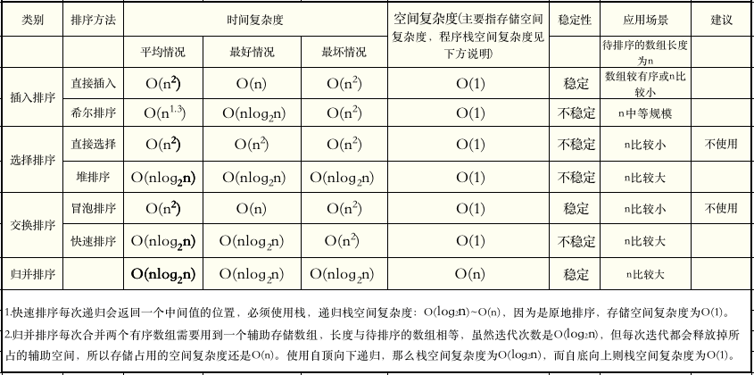

# Go 语言实现常见排序算法

- 冒泡排序
- 堆排序
- 插入排序
- 合并排序
- 选择排序
- 希尔排序

冒泡排序可以说是最差的排序算法。

我们把冒泡排序，直接选择排序，直接插入排序认为是初级的排序算法，其中直接插入排序的性能是综合最好的，一般来说，当排序数组规模 n 较小时，直接插入排序可能比任何排序算法都要快，建议只在小规模排序中使用。

希尔排序是对直接插入排序的改进版本，比直接选择排序和直接插入排序快，且随着规模的递增，这种性能提升越明显。因为算法容易理解，在排序数组中等规模下，我们可以使用它。在非常大的规模下，它的性能也不那么糟糕，但大规模排序还是建议使用以下的高级排序算法。

快速排序，归并排序和堆排序是比较高级的排序算法。

目前被认为综合最好的高级排序算法是快速排序，快速排序的平均用时最短，大多数的编程库内置的排序算法都是它。

堆排序也是一种很快的排序算法，通过维持一棵二叉树，树的根节点总是最大或最小从而可实现排序。

归并排序和快速排序一样使用分治法，递归地先使每个子序列有序，再将两个有序的序列进行合并成一个有序的序列。

